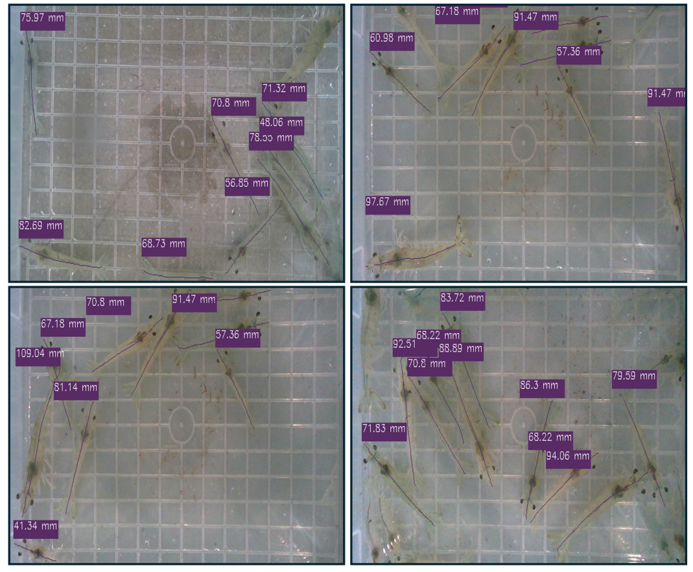
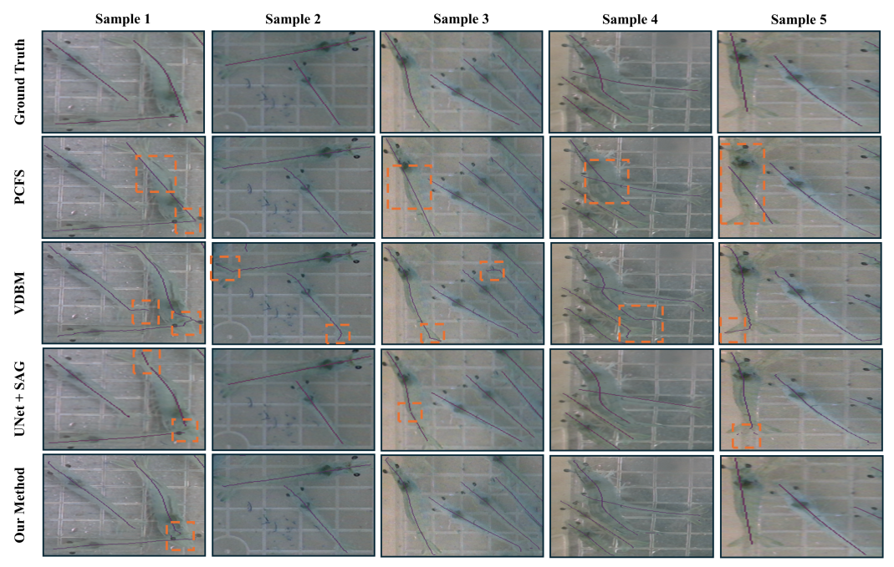

<div align="center">

# A Dual-Segmentation Framework for the Automatic Detection and Size Estimation of Shrimp




</div>

## Overview

Measuring shrimp size is essential for assessing growth, biomass and feed
management in aquaculture, yet it is hard to automate because shrimp have curved
postures, overlap each other and blend into the background. This repository
reconstructs the paper's **dual-segmentation** framework that estimates shrimp
length without manual handling:

1. **Instance segmentation** with **RTMDet-ins-m** isolates each shrimp.
2. A **proposed centerline segmentation model** (DeepLabv3 ASPP context fused with
   a U-Net encoder-decoder) predicts each shrimp's medial line from a fused
   RGB + mask input.
3. **Zhang–Suen thinning** reduces the centerline to one pixel wide; its arc
   length is converted to millimetres via calibration.

<div align="center">

</div>

## Key contributions

- A novel framework integrating **instance + semantic segmentation** to extract
  the shrimp centerline with **no heavy post-processing**, robust to pose and
  orientation.
- An **enhanced DeepLabv3 + U-Net** centerline model that prevents burrs and
  improves accuracy over baselines (F1 **88.3 %**, mIoU **79.1 %**, 2.1 M params).
- Two new shrimp datasets (instance segmentation + mask-to-centerline) and a
  full pipeline achieving **MAE 1.02 cm / RMSE 1.27 cm** size estimation.


## Installation

```bash
git clone https://github.com/MALIKMUHAMMADWAQAR/shrimps-length-estimation.git
cd shrimps-length-estimation

python -m venv .venv && source .venv/bin/activate
pip install -r requirements.txt        # or: conda env create -f environment.yml
pip install -e .                        # optional: install as a package
```

PyTorch wheels: install the CPU or CUDA build appropriate for your machine from
the [official selector](https://pytorch.org/get-started/locally/).


## Training

```bash
# Centerline model on real data (SGD, lr 0.02, 40 epochs, Dice+BCE)
python scripts/train.py --config configs/train.yaml --data-root datasets/centerline

# Quick synthetic smoke run
python scripts/train.py --config configs/train.yaml --synthetic --epochs 2
```

Mixed precision (`--amp`, CUDA) and multi-GPU (`torchrun`) are supported. The
RTMDet instance-segmentation stage follows the official OpenMMLab recipe — see
[`docs/training.md`](docs/training.md).

## Validation

```bash
python scripts/evaluate.py --config configs/val.yaml \
  --data-root datasets/centerline --checkpoint checkpoints/centerline_model.pth
```

Reports precision / recall / F1 / mIoU (Table 2) and MAE / RMSE (Table 3).

## Inference

```bash
# Full pipeline; writes results/inference.png with centerlines + sizes
python scripts/inference.py --config configs/infer.yaml \
  --checkpoint checkpoints/centerline_model.pth --pixel-to-mm 0.5

# Include the RTMDet detector for instance masks
python scripts/inference.py --full
```

Export the centerline model to ONNX:

```bash
python scripts/export_onnx.py --checkpoint checkpoints/centerline_model.pth \
  --output checkpoints/centerline_model.onnx
```

## Results

<div align="center">

</div>

| Stage | Metric | Score (paper) |
|-------|--------|---------------|
| Instance segmentation (RTMDet-m) | AP50 | **0.960** |
| Centerline segmentation (proposed) | F1 / mIoU | **0.883 / 0.791** |
| Size estimation (framework) | MAE / RMSE | **1.02 cm / 1.27 cm** |

Full tables are in [`docs/evaluation.md`](docs/evaluation.md).

## Citation

```bibtex
@article{waqar2025dualsegmentation,
  title   = {A Dual-Segmentation Framework for the Automatic Detection and Size Estimation of Shrimp},
  author  = {Waqar, Malik Muhammad and Ali, Hassan and Zhou, Heng and Mohamed, Heba G. and Kim, Sang Cheol and Strzelecki, Michal},
  journal = {Sensors},
  volume  = {25},
  number  = {18},
  pages   = {5830},
  year    = {2025},
  doi     = {10.3390/s25185830},
  publisher = {MDPI}
}
```

## Acknowledgements

This code reconstructs and builds on ideas from RTMDet, DeepLabv3, U-Net, MobileNetV2, and the Zhang–Suen thinning
algorithm.

## Contact

- Original corresponding author: Malik Muhammad Waqar (see the paper for details).
- Implementation issues: please open a GitHub issue. _Maintainer contact: 'malikwaqarhaider@gmail.com'
